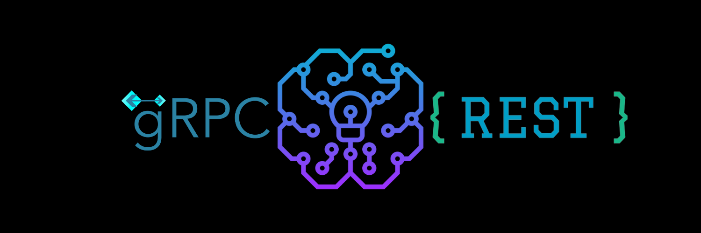

<!-- PROJECT LOGO -->
<br />
<p align="center">
  <a href="https://github.com/dao-duc-tung/inference-service-grpc-restful">
    
  </a>

  <h3 align="center">GRPC + RESTful Model Inference Service</h3>

  <p align="center">
    <a href="https://github.com/dao-duc-tung/inference-service-grpc-restful/issues">Report Bug</a>
    ·
    <a href="https://github.com/dao-duc-tung/inference-service-grpc-restful/issues">Request Feature</a>
  </p>
</p>

<!-- TABLE OF CONTENTS -->
<details open="open">
  <summary>Table of Contents</summary>
  <ol>
    <li><a href="#about-the-project">About The Project</a></li>
    <li><a href="#getting-started">Getting Started</a></li>
    <li><a href="#system-design">System Design</a></li>
    <li><a href="#extend-service">Extend Service</a></li>
    <li><a href="#contributing">Contributing</a></li>
    <li><a href="#license">License</a></li>
    <li><a href="#contact">Contact</a></li>
    <li><a href="#acknowledgements">Acknowledgements</a></li>
  </ol>
</details>

## About The Project

The purpose of the project is to build a Model Inference Service that supports:

- A gRPC endpoint that:

  - Receives the data as the model input
  - Saves the model input to the internal database
  - Runs the model inference process on the given model input
  - Saves the inference result to the internal database

- A RESTful endpoint that:

  - Receives the model input unique ID
  - Retrieves and returns the corresponding inference result

- The service architecture follows the [SOLID Principles](https://en.wikipedia.org/wiki/SOLID) to achieve maximal extendability. The service architecture can be extended to:

  - Support model downloading from any type of source. Eg: an URL, a local path, etc.
  - Support model loading and model inference processes in different Machine Learning frameworks. Eg: TensorFlow, PyTorch, custom Python script, etc.
  - Support different database technology. Eg: a relational database or a non-relational database.

To keep the project simple and architecture-focused, we use this [Ultra-lightweight face detection model](https://github.com/Linzaer/Ultra-Light-Fast-Generic-Face-Detector-1MB).

## Getting Started

### Quickstart

1. Install `docker` and `docker-compose`
1. Setup local environment for debugging purposes

   - Create and activate a virtual environment using `conda`, `venv`, or `pipenv`
   - Run

   ```bash
   pip install -r src/requirements.txt
   ```

1. Run the service

   ```bash
   # In terminal 1
   ./build_sys.sh
   # In terminal 2
   cd src
   python quick_start.py
   ```

### Development guide

The project uses `vscode` to develop. The debug configuration is already configured in `.vscode/launch.json`.

The project uses `docker-compose` to manage the deployment environment and the coordination between docker containers. To build and run the service, run:

```bash
# 1. Run service and tests
./build_sys.sh test

# 2. Run service and slow tests
# Slow tests are tests that run in > ~1 second
./build_sys.sh test --runslow

# 3. Run service without running tests
./build_sys.sh

# 4. Run tests outside of the docker containers
# 4.1. Run service first
./build_sys.sh
# 4.2. In your local dev environment, run
cd src
pytest -m client --runslow
```

### API usage

Please check function `test_two_apis_good_content()` in [src/test_integration/test_client_two_apis.py](src/test_integration/test_client_two_apis.py) for the code example of calling the two APIs from the outside of the docker containers.

#### Invoke Model

```python
id = 1
img_path = "images/lenna.png"
metadata = []

# Create ModelInput
base64_str = ImgUtils.img_path_to_base64_str(img_path)
model_input = ModelInput(id=id, content=base64_str, metadata=metadata)

# Create request
request = InvocationRequest(model_input=model_input)

# Create gRPC client
channel = grpc.insecure_channel(f"localhost:8000")
client = InvocationStub(channel)

# Call gRPC endpoint
response = client.Invoke(request)
```

#### Get Invocation Info

```python
id = 1
response = urlopen(f"http://localhost:5000/invocation/{id}"
response = response.read().decode("utf-8")
response_dict = json.loads(response)
```

### Change implementations

Currently, the service uses a trained face detection model. To change the model path, please refer to [src/main.py](src/main.py).

The service currently supports only the TensorFlow framework for the face detection model. To change the framework, you need to implement a new `Model Manager`. For more details, please refer to the section [Add a new Model Manager](#add-a-new-model-manager). To change the model framework, please refer to [src/main.py](src/main.py).

The service currently supports the in-memory DBMS (use some variables to store data) and the Redis DBMS. To change the DBMS implementation, please refer to [src/main.py](src/main.py).

## System Design

### Functional requirements

- API 1 - gRPC-based API

  - Input: model input with id, content, and metadata
  - Job: run model inference on the given input, save model outputs to the database
  - Output: none

- API 2 - RESTful-based API

  - Input: input id
  - Job: retrieve model input by input id, retrieve corresponding model outputs
  - Output: content, model output

- Model is loaded at runtime when starting the app. Note that the service currently supports only one model but it can be extended to support multiple models

### Non-functional requirements

- Adaptability
  - Load model from S3 URL, filesystem
  - Support machine learning frameworks: TensorFlow, PyTorch, MXNet, ONNX, custom Python script, etc
  - Flexible to change the database technology
- Reliability: Service is resilient, handles errors
- Testability: Write unit tests, integration tests

### API design

- API 1: `invokeModel(model_input)` -> `None`
- API 2: `getInvocationInfo(model_input_id)` -> `(model_input, model_output)`

### Architecture overview

![service-architecture][service-architecture]

Service's responsibilities:

- Manage Model Manager and Database Manager
- Run model inference when invokeModel() API is called via the Model Manager
- Save model input and model output to the database via Database Manager
- Retrieve model input and model output when getInvocationInfo() API is called via Database Manager

### Data flow

![data-flow][data-flow]

This Data Flow diagram shows the data flow in the service.

When `External Service` sends a request to the `gRPC Invoke Model Endpoint`, the endpoint unwraps the request to get a `Model Input` object and passes it to `Service Controller`. `Service Controller` asks `Model Manager` to run the model inference process on the given `Model Input`. The prediction result is wrapped in a `Model Output` object. This object is sent back to `Service Controller`. `Service Controller` asks `Database Manager` to save this `Model Output` object and its corresponding `Model Input` object to the database.

When `External Service` sends a request to the `RESTful Get Invocation Info Endpoint`, the endpoint unwraps the request to get the `Model Input`'s ID. This ID is passed to the `Service Controller`. `Service Controller` asks `Database Manager` to retrieve the corresponding `Model Input` data and `Model Output` data. The retrieved data is then passed back to `RESTful Get Invocation Info Endpoint`. The endpoint responds the data to the `External Service`.

### Sequence diagram

These sequence diagrams below intuitively describe the data flow of the two main actions which are invoking the model and getting invocation info.

![invoke-model-sequence-diagram][invoke-model-sequence-diagram]

![get-invocation-info-sequence-diagram][get-invocation-info-sequence-diagram]

### Database management system (DBMS)

The service currently uses the Redis database as the DBMS. Using Redis as a non-relational database gives us some benefits such as:

- Flexible schema design
- Supports varieties of data structures
- High scalability
- High performance

The main reasons why we use the non-relational database are:

- The model input data can be anything such as image data, numerical data, binary data, URL, etc.
- The primary key is known. Eg: model input's unique ID
- The access pattern is known. Eg: APIs are small and well-defined for this small service

#### Backup strategy

When running the database inside a docker container, we want to back up the database to a folder in the local machine. To achieve this, we just need to mount a folder in the local machine to the `/data` folder inside the Redis database container. For more details, please check `docker-compose.yml`.

### Logging

The service uses Python `logging` module to log the data to file and to console at the same time. The service writes the logs to files that are stored in the `src/log` folder.

To update the log handlers and log level, please refer to [src/utils/logger.py](src/utils/logger.py).

#### Logging synchronization

The `src/log` folder is mounted to the docker container where the service runs to synchronize the logs with the local machine.

## Extend Service

### Add a new Model Manager

The new Model Manager must implement the `IModelMgr` interface as below. For more details, please check [src/model_module/i_model_mgr.py](src/model_module/i_model_mgr.py).

```python
class IModelMgr:
    @property
    def is_model_loaded(self) -> bool:
        raise NotImplementedError()

    def get_model(self, *args, **kwargs):
        raise NotImplementedError()

    def load_model(self, model_source: IModelSource, *args, **kwargs):
        raise NotImplementedError()

    def invoke(self, model_input: ModelInput, *args, **kwargs) -> ModelOutput:
        raise NotImplementedError()
```

The Model Manager can be a dedicated one that supports a specific Machine Learning library (eg. TensorFlow, PyTorch, etc.) or it can be a generic Model Manager that wraps a bunch of the dedicated ones. The service currently implements the generic Model Manager. For more details, please check [src/model_module/model_mgr.py](src/model_module/model_mgr.py).

The service currently also implements a dedicated Model Manager for Tensorflow. For more details, please check [src/model_module/tensorflow_model_mgr.py](src/model_module/tensorflow_model_mgr.py).

### Add a new Database Manager

The new Database Manager must implement the `IDatabaseMgr` interface as below. For more details, please check [src/data_module/i_database_mgr.py](src/data_module/i_database_mgr.py).

```python
class IDatabaseMgr:
    @property
    def is_connected(self) -> bool:
        raise NotImplementedError()

    def connect(self, *args, **kwargs) -> bool:
        raise NotImplementedError()

    def close(self, *args, **kwargs) -> bool:
        raise NotImplementedError()

    def flush_all(self, *args, **kwargs) -> bool:
        raise NotImplementedError()

    def save_model_input(self, model_input: ModelInput, *args, **kwargs):
        raise NotImplementedError()

    def save_model_output(
        self, model_input: ModelInput, model_output: ModelOutput, *args, **kwargs
    ):
        raise NotImplementedError()

    def retrieve_model_input(self, model_input_id: str, *args, **kwargs):
        raise NotImplementedError()

    def retrieve_model_output(self, model_input_id: str, *args, **kwargs):
        raise NotImplementedError()

    def delete_model_input(self, model_input_id: str, *args, **kwargs):
        raise NotImplementedError()

    def delete_model_output(self, model_input_id: str, *args, **kwargs):
        raise NotImplementedError()
```

The service currently implements two Database Manager which are the `InMemoryDatabaseMgr` and `RedisDatabaseMgr`. For more details, please check [src/data_module/in_memory_database_mgr.py](src/data_module/in_memory_database_mgr.py) and [src/data_module/redis_database_mgr.py](src/data_module/redis_database_mgr.py), respectively.

### Update protobufs

The protobuf files are stored in folder `protobufs`. The file [protobufs/model.proto](protobufs/model.proto) defines the `Model Input` and `Model Output` formats. The file [protobufs/invocation.proto](protobufs/invocation.proto) defines the `Invocation` service.

New protobuf files should be put into this `protobufs` folder. The reason why we leave the `protobufs` folder outside of the `src` folder is that usually we have tons of protobuf files and we want to keep them in a dedicated repository so they can be reusable. Keeping the `protobufs` folder outside of the `src` folder also makes the Python source code easier to explore when switching between different Python files and protobuf files.

## Contributing

Contributions make the open source community such an amazing place to learn, inspire, and create. Any contributions you make are **greatly appreciated**.

1. Fork the Project
2. Create your Feature Branch (`git checkout -b feature/FeatureName`)
3. Commit your Changes (`git commit -m 'Add some FeatureName'`)
4. Push to the Branch (`git push origin feature/FeatureName`)
5. Open a Pull Request

## License

Distributed under the MIT License. See [LICENSE](LICENSE) for more information.

## Contact

Tung Dao - [LinkedIn](https://www.linkedin.com/in/tungdao17/)

Project Link: [https://github.com/dao-duc-tung/inference-service-grpc-restful](https://github.com/dao-duc-tung/inference-service-grpc-restful)

## Acknowledgements

- [Ultra-Light-Fast-Generic-Face-Detector-1MB](https://github.com/Linzaer/Ultra-Light-Fast-Generic-Face-Detector-1MB)
- [Ultra-Light-Fast-Generic-Face-Detector-Tensorflow Converter](https://github.com/jason9075/Ultra-Light-Fast-Generic-Face-Detector_Tensorflow-Model-Converter)
- [gRPC](https://grpc.io/)
- [Redis](https://redis.io/)

<!-- MARKDOWN LINKS & IMAGES -->

[service-architecture]: media/service-architecture.png
[data-flow]: media/data-flow.png
[invoke-model-sequence-diagram]: media/invoke-model-sequence-diagram.png
[get-invocation-info-sequence-diagram]: media/get-invocation-info-sequence-diagram.png
